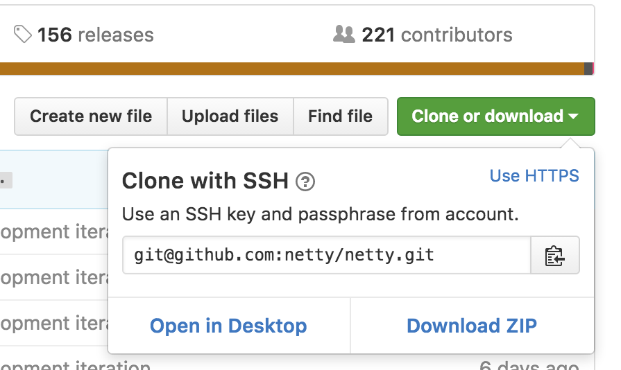
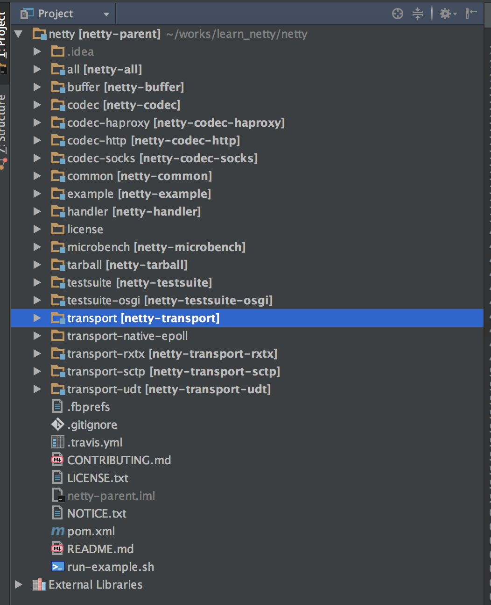
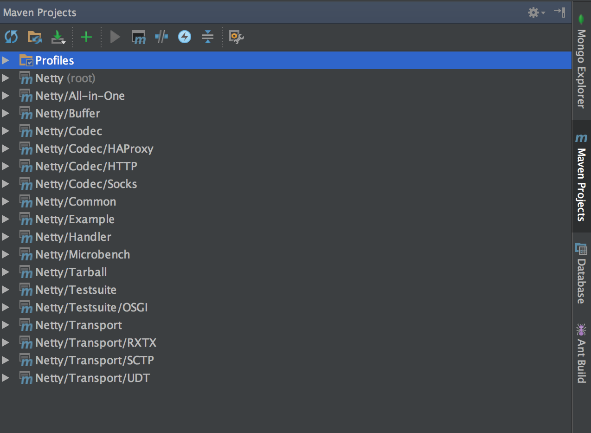

## 0-磨刀不误砍柴工 源码分析环境搭建

### 代码下载
首先到 Netty 的 [Github仓库](https://github.com/netty/netty) 中， 点击右边绿色的按钮：

拷贝 git 地址： https://github.com/netty/netty.git
然后在终端中输入如下命令， 克隆 Netty 工程：
```
/Users/kext/works/learn_netty
>>> git clone https://github.com/netty/netty.git
Cloning into 'netty'...
```
Netty 工程源码较大， 加上国内网络问题， 下载 Netty 源码可能会比较耗时.
当有如下输出时， 表示克隆成功了：
```
/Users/kext/works/learn_netty
>>> git clone https://github.com/netty/netty.git
Cloning into 'netty'...
remote: Counting objects: 210696, done.
remote: Compressing objects: 100% (93/93), done.
remote: Total 210696 (delta 33), reused 0 (delta 0), pack-reused 210587
Receiving objects: 100% (210696/210696), 40.38 MiB | 155.00 KiB/s, done.
Resolving deltas: 100% (93595/93595), done.
Checking connectivity... done.
```

当下载好后， 可以创建我们自己的一个分支， 用于代码的学习：
```
git checkout netty-4.1.34.Final
git checkout -b learn_netty_4.1.34
```
我们从 Netty 的 4.1.34.Final tag 中创建了自己的分支 **learn_netty_4.1.34**， 便于我们的源码的学习。

### IntelliJ IDEA 配置
用 IntelliJ IDEA 打开工程， 工程结构如下：

一般情况下， 此时我们就可以打开 example 目录， 运行下面的例子了。

不过有些读者可能会遇到 Maven 依赖下不全的问题， 此时我们可以点击右边的 Maven Project 标签， 然后点击蓝色的刷新按钮：



接下来我们可以运行 example 下的 EchoServer 看看：


如上图所示， 点击左边的绿色三角箭头即可运行了。